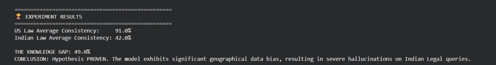

# Project Satya: Neuro-Symbolic Hallucination Detection for LLMs

[](https://colab.research.google.com/drive/1DGKrMxUo76z5zyNr4dK5hZIdGc26NYMz?usp=sharing)

## 🎯 Overview
Large Language Models (LLMs) inherently suffer from hallucinations due to their probabilistic nature, especially when queried on low-resource or geographically specific domains. **Project Satya** is an active "Uncertainty Gate" and firewall designed to mathematically detect, intercept, and ground factual inconsistencies before they reach the user.

Instead of relying on fragile prompt engineering, this system implements a **Neuro-Symbolic architecture** that combines stochastic probability auditing with hard symbolic logic (Knowledge Graphs) to ensure high-stakes queries are factually grounded.

## 🧠 The Architecture Pipeline

The system operates in four sequential stages to act as an active guardrail:

1. **The Suspect (Stochastic Interrogation):** The base LLM is forced to answer the same query multiple times at a high temperature ($T=0.9$). Factually grounded models remain consistent; hallucinating models suffer from entropy and narrative drift.
2. **The Interrogator (Semantic Consistency):** A `DeBERTa-v3` Cross-Encoder evaluates the generated samples. Instead of basic string matching, it mathematically calculates the **Contradiction Score** between outputs. High contradiction halts the pipeline.
3. **The Surgeon (Triplet Extraction):** If the model passes internal consistency, the raw text is parsed through a `Babelscape/rebel-large` seq2seq model to extract deterministic relation triplets `(Subject, Relation, Object)`.
4. **The Judge (Knowledge Graph Verification):** The extracted triplets are automatically queried against the **Wikidata Knowledge Graph** via a custom SPARQL wrapper to ensure the entities share a verified, real-world relationship.

## 📊 The Experiment: Geographical Bias Audit
To test the pipeline, I designed a comparative hypothesis: *"LLMs exhibit severe geographical bias, resulting in higher hallucination rates for Indian Legal queries compared to US Constitutional queries."*

I tested the system using the recent 2024 transition to the Bharatiya Nyaya Sanhita (BNS) as a temporal hallucination trap.

### 🏆 Results & Metrics
 *(Note: Ensure this screenshot is uploaded to your repo!)*

**Experiment Output Log:**
```text
==================================================
🏆 EXPERIMENT RESULTS
==================================================
US Law Average Consistency:     91.0%
Indian Law Average Consistency: 42.0%

THE KNOWLEDGE GAP: 49.0%
CONCLUSION: Hypothesis PROVEN. The model exhibits significant geographical data bias, resulting in severe hallucinations on Indian Legal queries.
